# 51Degrees Pipeline API

 **Pipeline API - WordPress plugin**

[Developer Documentation](https://51degrees.com/device-detection-php/4.3/md__home_vsts_work_1_s_apis_device-detection-php_readme.html "Developer Documentation")

# Introduction
This plugin makes use of the 51Degrees Pipeline API to deliver various data intelligence [services](https://51degrees.com/services). You can also add custom dimensions to your Google Analytics solution which will enhance your analytical data. With 51Degrees you can capture and pipe various properties into GA such as screen orientation and screen size.

# Pre-requesites

In order to use this plugin, you will need to create a `resource key`. This enables access to the data you need via the 51Degrees cloud service.

You can create a `resource key` for free, using the [configurator](https://configure.51degrees.com/) to select the properties you want.

# Installation

Following three ways can be used to install 51Degrees WordPress Plugin.

## Installation from within WordPress

1. Visit `Plugins > Add New`.
2. Search for `51Degrees`.
3. Install and activate the 51Degrees plugin.
 
## Manual installation using WordPress Plugin Manager

1. Download `fiftyonedegrees` zip package from [WordPress Plugin Manager](https://wordpress.org/plugins/wp-plugin-manager/).
2. Upload the entire `fiftyonedegrees` zip folder to the `/wp-content/plugins/` directory.
3. Visit `Plugins`.
4. Activate the 51Degrees plugin.

## Manual installation using GitHub Repository

If you want to build the plugin yourself and install locally, you will need to follow these steps:

1. Clone 51Degrees plugin GitHub repository from [here](https://github.com/51Degrees/pipeline-wordpress/).
2. Execute `composer install` in the `lib` directory.
3. Create a new directory outside this repo called `fiftyonedegrees` and copy all directories and php files from the root of this repo into it.
4. Copy the `fiftyonedegrees` directory into your 'wp-content/plugins' directory.
5. Visit `Plugins`.
6. Activate the 51Degrees plugin.

# Google Analytics

51Degrees plugin allows you to add the Device Data Properties as Custom Dimensions to Google Analytics in a seamless and useful manner. The integration is super simple and does not require the help of a developer to set up the integration. Once you integrate Google Analytics in WordPress using 51Degrees, you will be able to fetch the Custom Dimensions in the Google Analytics Custom Reports to get the Useful Insights.

## Integration With Google Analytics

1. To integrate with Google Analytics goto `Google Analytics` tab and click `Log in with Google Analytics Account` button.

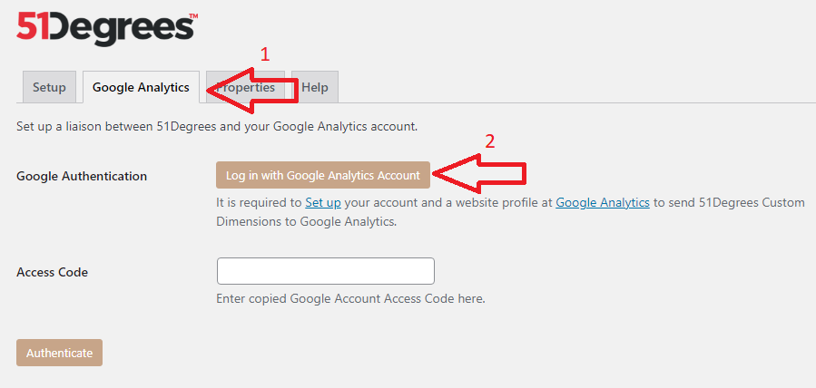

2. Follow the steps and give 51Degrees plugin the required permissions and copy the provided Google Analytics `Access Code` in the end.

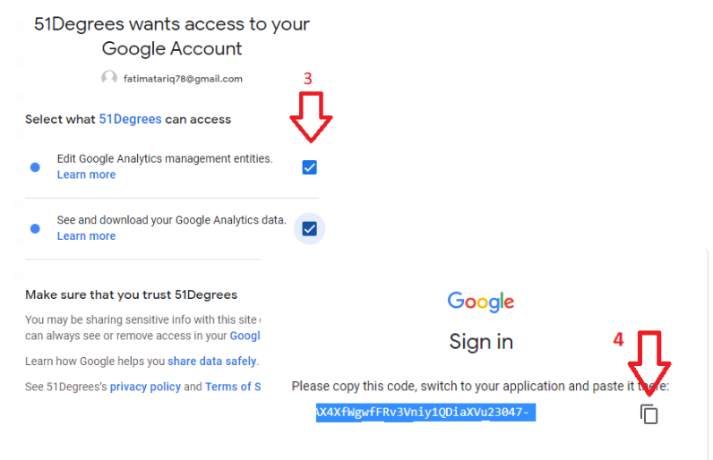

3. Enter the copied Code in `Access Code` text field and click `Authenticate`. This will connect your Google Analytics Account to 51Degrees Plugin.

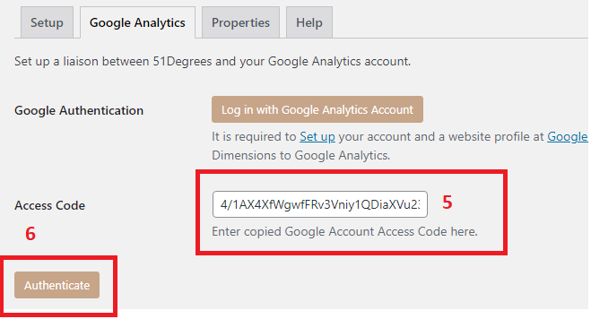

4. After authentication, select your preferred profiles for which you want to enable Custom Dimensions Tracking via `Google Analytics Property` dropdown.

5. Check `Send Page View` if you want to send Default Page View hit along with Custom Dimensions. It is only recommended if you have not already integrated with any other Google Analytics plugin to avoid data duplication.

6. Click `Save Changes`. This will prompt to new Custom Dimensions Screen where you can find all the Custom Dimensions available with resource key.

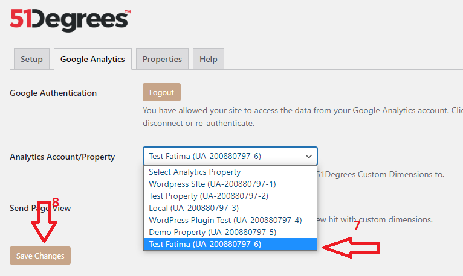

7. Click on `Enable Google Analytics Tracking` to enable tracking of all the Device Data Properties as Custom Dimensions.

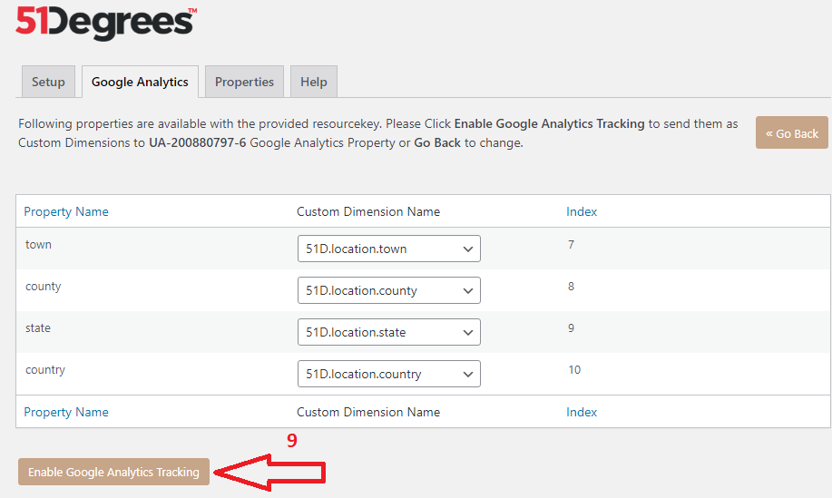


# Other Features

## Value replacement

You can insert snippets into your pages that will be replaced with the corresponding value.

For example, the text `{Pipeline::get("device", "browsername")}` would be replaced with `Chrome`, `Safari`, `Firefox`, etc. Depending on the browser being used by the person visiting your site.

In this case, we display the vendor, name and version number of the client's browser:

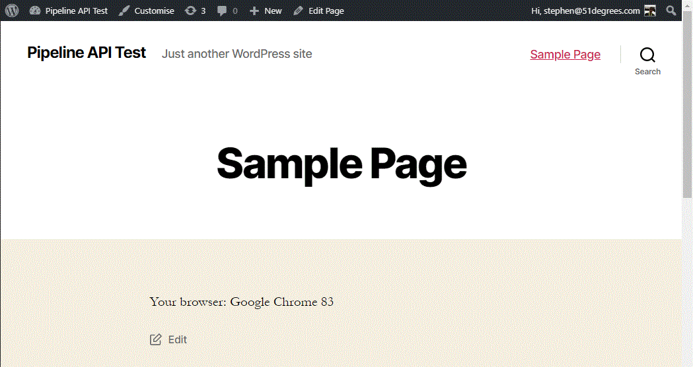

To set this up, we take the text from the 'Usage in Content' column on the 'Properties' tab of the plugin:

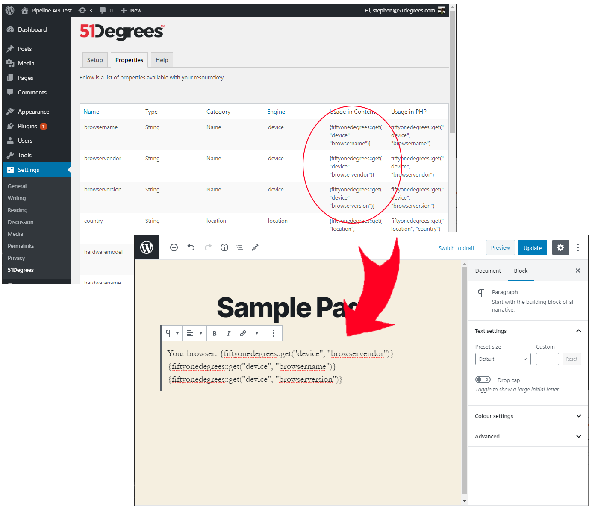

## Conditional blocks

This feature allows you to show/hide content based on the property values supplied by the Pipeline API.

To start, add a new block and select the `51Degrees conditional group block`:

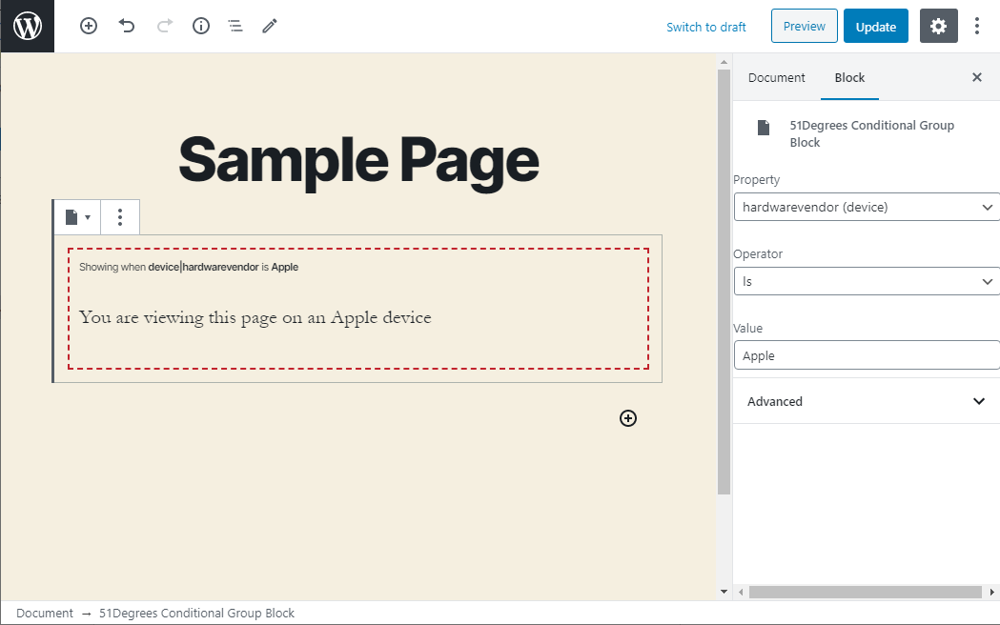

Select the block to display the configuration UI on the right-hand side. In the example below, the block has been configured to only appear if the hardware vendor property is 'Apple':

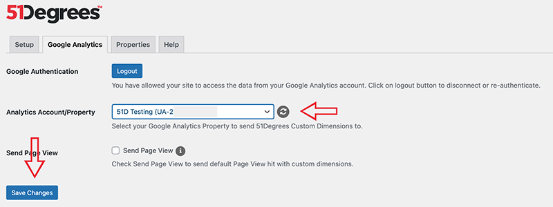


## Accessing properties in PHP code

To get a specific property, look it up on the available properties list and use the get() method specified.

```Pipeline::get("device", "ismobile")```

You can also get a list of properties by category as an array:

```Pipeline::getCategory("Supported Media"))```


## JavaScript integration

The 51Degrees library exposes the same property values in JavaScript. These are accessed through the global 'fod' object

```
<script type="text/javascript" >
	window.onload = function() {
	  fod.complete(function(data){
	  // console.log(data.device.screenpixelswidth);
	  });
	}
</script>
```

In some cases, additional evidence needs to be gathered by running JavaScript on the client. This is mostly handled automatically by the plugin and the fod object. For specific examples, see the 'Location' and 'Apple device models' sections below

## Location

Location works slightly differently to other properties. Currently, the address is determined from the location provided by the client device. When this data is requested, a confirmation pop-up similar to the following will appear:

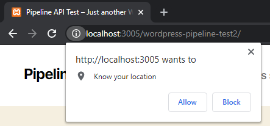

It is good practice to delay the appearance of this pop-up until the location is really needed. Otherwise, the user may not know why they are being asked for the information and is more likely to refuse.

To facilitate this, the location data needs to be explicitly requested by adding some additional JavaScript. There are many ways to do this but for an example, we have gone with the simplest approach.

Firstly, add a button to your page. Make sure to set a css class that we can use to identify this button and add an event to it.

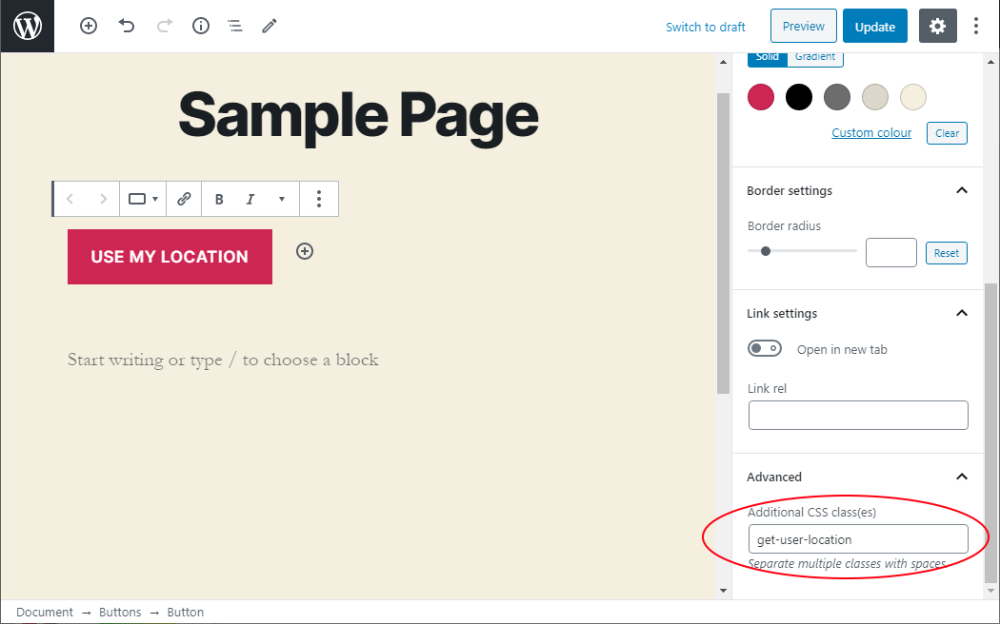

Next, add an HTML element and paste the following snippet of code into it:

```
<script type="text/javascript" >
	window.onload = function() {
	  var elements = document.getElementsByClassName('get-user-location');

	  for(var i = 0; i < elements.length; i++) {
		elements[i].addEventListener('click', function() {
		  fod.complete(function(data) { /* use values here if needed e.g. data.location.country will contain country the user is in */ }, 'location');
		});
	  }
	};
</script>
```

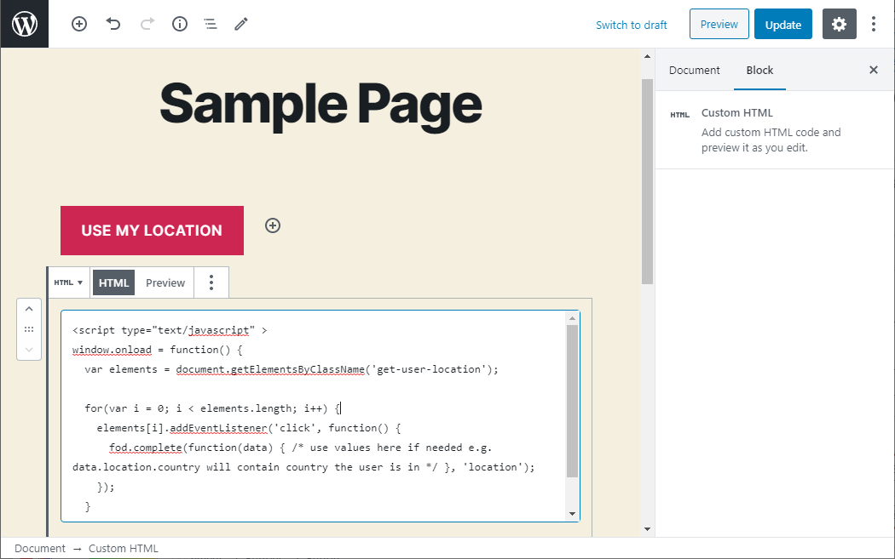

Now, when the user clicks on the 'Use my location' button, the JavaScript that we pasted in will execute. This lets the global `fod` object know that we want access to the location data, which in turn causes the 'wants to know your location' confirmation pop-up to be displayed.

Note that on the first request, the server will not have the location information so the location properties will not have values: 

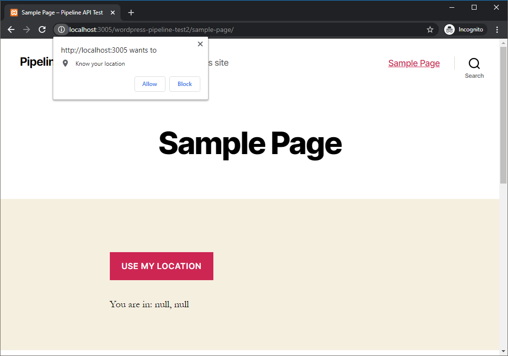

After the button is clicked, we need to make another request to the server for the location values to be populated:

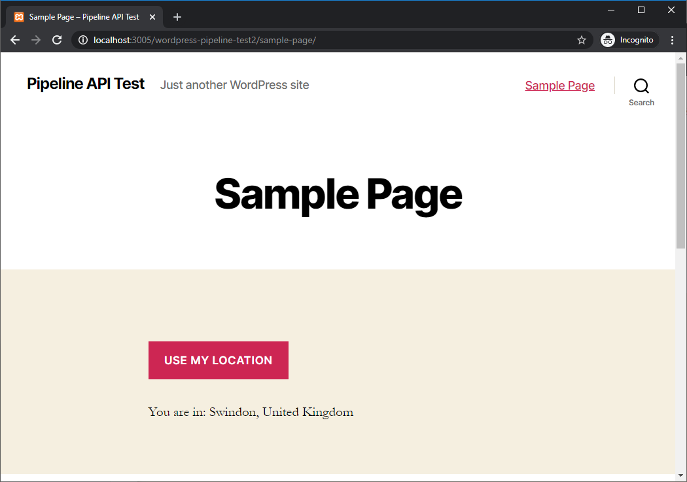

Note that the content on the page can also be updated by using JavaScript, rather than waiting for the user to make a second request. This involves editing the JavaScript snippet above to update the page within the callback function that is passed to fod.complete.

## Apple device models

Determining the exact model of Apple devices is more difficult that others. This is because Apple include only very limited information about the device hardware in the 'User-Agent' HTTP header that is sent to the webserver.

To get around this problem, device detection uses JavaScript that runs directly on the client to gether some additional information. This can usually be used to determine the exact model of device and will at least narrow down the possibilities.

The WordPress plugin will handle this for you automatically. However, be aware that, due to having to get additional data from the client, the model may be less clear on the first request than on subsequent requests.

For example, using an iPhone 6 Plus, the `hardwareName` property contains the following array of values on the first request:

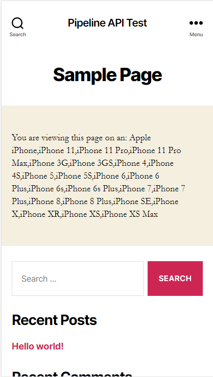

After the JavaScript runs on the client, a second request is made and the array of values has been significantly narrowed down:

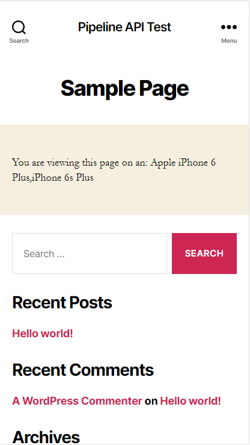

The content on the page can also be updated by using JavaScript, rather than waiting for the user to make a second request. The global `fod` object can be used to pass a callback that is executed when the updated values are available. For example:

```
<script type="text/javascript" >
	window.onload = function() {
	  fod.complete(function(data) { /* access values here. e.g. data.device.hardwarename */ });
	};
</script>
```

# Project documentation

For complete documentation on the Pipeline API and associated engines, see the [51Degrees documentation][Documentation].
Note that the WordPress plugin is built on top of the PHP implementation of the Pipeline API

[Documentation]: https://51degrees.com/device-detection-php/4.3/md__home_vsts_work_1_s_apis_device-detection-php_readme.html